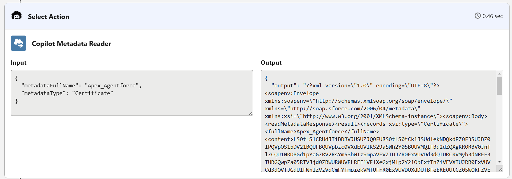

# Lightweight - Agentforce Metadata Agent
This is an example of an agent that can list and show metadata.
It's a proof of concept / art of the possible not really a production grade tool. It is very temperamental when it comes to reverse engineering. Usually it works but it might fail out of nowhere with random errors that have probably to do with the Salesforce guardrails doing their job.

The function of this repo is to show the art of the possible and also show how an agent can be packaged and lean the effects a namespace has. (2GP is not yet possible as per December 2025)

## Blog
No blog yet

## What to ask the agent
List all metadata of a specific type (Will crash if the list is too big, so wont work for sObjects etc.)

* `List all metadata of the type "RemoteSiteSetting"` 

Show the metadata for a specific metadata item
* `Show me the metadata details for the metadata item named "Einstein_Platform" of the metadata type "RemoteSiteSetting"`

Combine the two with follow up questions
* `Show me a list of all "Certificate" metadata`
* `Show me "CertificateName"`

## Dependency Info
| Info | Value |
|---|---|
|Name                     |Lightweight - Apex SOAP Util                             |
|Version                  | 0.2.0-1                                                 |
|Managed Installation URL | */packaging/installPackage.apexp?p0=04tP3000000uNzdIAE* |
|Unlocked Installation URL| */packaging/installPackage.apexp?p0=04tP3000000uO1FIAU* |
|Github URL               | https://github.com/jfwberg/lightweight-soap-util        |

## Package Info
- Second generation package is not yet supported

# Links
- [Metadata Coverage Report (Search for "GenAI")](https://developer.salesforce.com/docs/metadata-coverage/62)
- [Agents ISV Guide](https://resources.docs.salesforce.com/rel1/doc/en-us/static/pdf/agents_isv_guide.pdf)

# Pics or it did not happen

